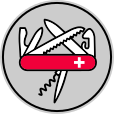

# MikeNakis.Kit My library of indispensable utilities

  

## License

**All rights reserved.**

For more information, see [LICENSE.md](LICENSE.md)

## Coding style

This project is written using _**my very own™**_ coding style.

More information: [michael.gr - On Coding Style](https://blog.michael.gr/2018/04/on-coding-style.html)

TODO: 

- Supplementary files such as README.md cannot live at the solution level; they must be moved to the project level.
- Must decide what to do with DEBUG vs. RELEASE builds.
  - Here is an idea: Do as in Java; have a global 'Debug' variable.

----------------------
Cover image: The MikeNakis.Kit logo, <i>a Swiss army knife</i> by Mike Nakis, based on original work by <a href="https://thenounproject.com/term/multi-tool/1641155/">Mariah Gardziola</a> from the Noun Project, license: "<a href="https://creativecommons.org/licenses/by/3.0/us/">CC BY</a>".
